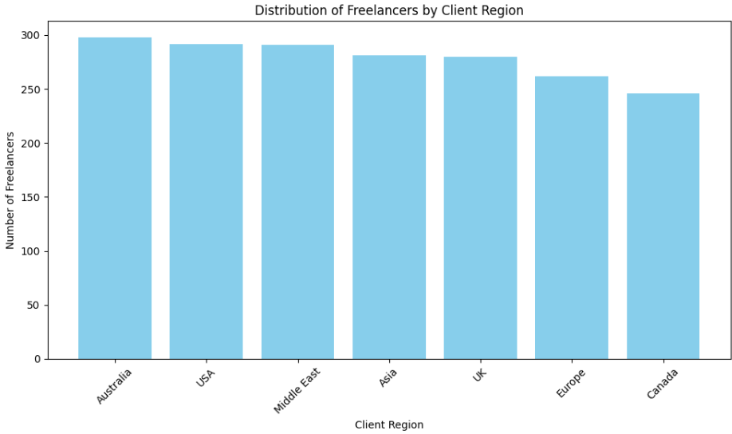

## Problem Statement
The goal was to create a system capable of answering questions (in English, Russian, or other natural language) about a real-world dataset of freelancer earnings. The application should support command-line interaction and dynamically interpret queries using LLMs.

## Approach
    I used the LangChain framework with a Pandas DataFrame Agent, enabling natural language queries over tabular data.
    The user query is passed to an LLM (Qwen or OpenAI) which interprets the intent and runs relevant pandas operations.
    The CLI supports both:
        One-off questions via python main.py "question"
        Interactive chat mode
        Verbose mode for debugging
    Matplotlib plots are not used in the CLI version, can be seen in the Jupyter Notebook.
```bash
response = agent.invoke("show distribution of freelancers by client region")
print(response["output"])
```


## Technologies and Methods Used

* Python 3.11
* LangChain for agent construction
* pandas for data manipulation
* matplotlib for plotting
* argparse for CLI parsing
* Jupyter for prototyping
* Qwen API for natural language understanding

## What Worked

* LangChain + Pandas agent answered most analytical questions correctly.
* Multi-language questions (e.g. Russian) were correctly interpreted.
* Filtering, grouping, and statistical questions were handled accurately.

## What Didn’t Work or Was Limited

* Matplotlib output does not display inline in CLI → handled via saving to files.
* Some ambiguous or overly general queries led to errors or vague answers.
* Performance depends on LLM latency and dataset size.

## Evaluation Criteria (Self-defined)

| Metric                  |	Comment |
|-------------------------|---------------|
| Correctness of responses|	>90% of structured analytical queries returned expected results |
| CLI UX                  |	Fully interactive + supports command-line arguments|
| Multi-language support  |	Russian + English queries understood|
| Modularity	           | Code is split into agent logic and CLI logic|
|  Reproducibility        |	All code + data are in the GitHub repo|


## Overall Assessment
The system successfully meets the task requirements: \
it allows users to ask analytical questions about a real dataset\
using natural language, with dynamic interpretation and feedback via CLI.\
The code is clean, modular, and easily extensible.